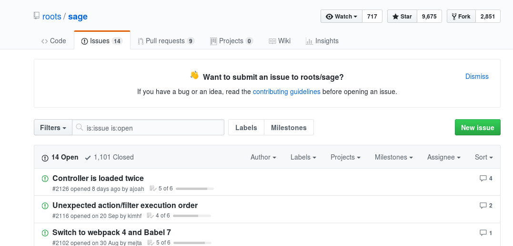
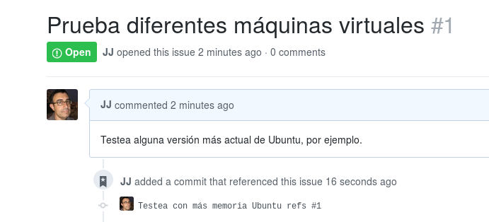
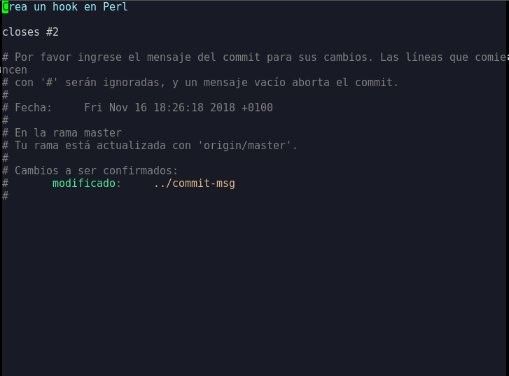

<!DOCTYPE html>
<html lang="en">
  <head>
    <meta charset="utf-8" />
    <meta name="viewport" content="width=device-width, initial-scale=1.0, maximum-scale=1.0, user-scalable=no" />

    <title>reveal-md</title>
    <link rel="stylesheet" href="./css/reveal.css" />
    <link rel="stylesheet" href="./css/theme/black.css" id="theme" />
    <link rel="stylesheet" href="./css/highlight/zenburn.css" />
    <link rel="stylesheet" href="./css/print/paper.css" type="text/css" media="print" />

  </head>
  <body>
    <div class="reveal">
      <div class="slides">
        <section  data-markdown># `git` como estilo de vida

`@jjmerelo`
        </section>

        <section data-markdown>
          

* Autor (con `@psicobyte_`) de "Aprende git")
* ♥ Perl 6
* Profe en UGR
        </section>

        <section data-markdown>
          # `git`

        </section>

       <section data-markdown>


# ¿Para qué sirve?


<aside class='notes'>
Hay mucho material dirigido específicamente a Wordpress, como este
curso: https://wppusher.com/wordpress-git-course 
En general, no se trata de algo demasiado especial, salvo los
requisitos específicos por estar desarrollando contra un sistema de
gestió de contenidos
</aside>
</script></section><section  data-markdown><script type="text/template">


# Para la nube
</script></section><section  data-markdown><script type="text/template">

# Pero ¿qué es?


</script></section><section  data-markdown><script type="text/template">

# Un sistema de ficheros direccionado por contenido


</script></section><section  data-markdown><script type="text/template">

# Con un sistema de gestión de versiones encima


</script></section><section  data-markdown><script type="text/template">


# Distribuido

<aside class='notes'>
El que sea distribuido permite que se pueda trabajar y hacer `push` a
repos remotos, y es lo que lo ha convertido en una herramienta de
despliegue
</aside></script></section><section  data-markdown><script type="text/template">


# Con un sistema de eventos

<aside class='notes'>
Este sistema de eventos o *ganchos* sirve para lanzar acciones cada
vez que sucede algo, y permite regular flujos de trabajo.
</aside></script></section><section  data-markdown><script type="text/template">

# *filesystem* direccionado por contenido tiene:

</script></section><section  data-markdown><script type="text/template">

# *Blobs*

</script></section><section  data-markdown><script type="text/template">

# *Trees*


</script></section><section  data-markdown><script type="text/template">

# Y un sistema de gestión de fuentes tiene:


</script></section><section  data-markdown><script type="text/template">


# * Commits * 
</script></section><section  data-markdown><script type="text/template">


# * Tags * 

<aside class='notes'>
Los objetos tipo Tag apuntan a un commit en una referencia inmutable https://git-scm.com/book/en/v2/Git-Internals-Git-References
</aside>
</script></section><section  data-markdown><script type="text/template">

# Aloja repos en GitHub, Bitbucket o Gitlab


<aside class='notes'>
Cada uno tiene sus ventajas y sus inconvenientes, aunque sin duda el
más popular para proyectos libres es GitHub. Si no es libre, Bitbucket
te permite una cierta cantidad de repos privados, igual que
GitLab. GitHub tiene muchas más integraciones que el resto, pero en
general es una elección personal o, por supuesto, corporativa
Un artículo sobre esto: https://www.elegantthemes.com/blog/tips-tricks/answering-the-most-important-questions-about-using-git-with-wordpress
</aside></script></section><section  data-markdown><script type="text/template">export default FullScreenCode

```bash
git clone <URL con git o https>
git add <nuevo fichero>
git commit -m "Explico el cambio"
git pull # Evitando conflictos
git push
```

<aside class='notes'>
Se trata de un *shallow clone*
https://stackoverflow.com/questions/23708231/git-shallow-clone-clone-depth-misses-remote-branches
Descarga commits hasta un máximo de uno, es decir, el estado del repo
en el último commit y ya está. No puedes consultar la historia, por
ejemplo. También ponemos un tag para volver aquí cuando
queramos. También empezamos a ver la naturaleza distribuida de git,
manejando dos remotes, el original que se suele llamar *upstream*
</aside>
</script></section>
<section  data-markdown><script type="text/template">### ①②③ Para los ránkings de `@iblancasa`


</script>
<aside class='notes'>
Estos ránkings los inicié yo, pero ahora se publican todos los
miércoles, Tienen ránkings por comunidad autónoma y provincia y
también nacionales, en JSON o MD. Te pueden servir para descubrir a
gente cerca tuyo o simplemente para picarte con tus compis
</aside></section>
<section  data-markdown><script type="text/template">
# Organízate

## *Issues* y *milestones* al rescate


</script>
<aside class='notes'>
Los issues y milestones (o mojones) de los sitios de hosting como github son una
forma de organización de un equipo de trabajo, y también una buena
forma de comunicarse con la comunidad de software libre
</aside></section>


<section  data-markdown><script type="text/template">## Por ejemplo: contribuyentes en *Hacktoberfest*

</script></section><section  data-markdown><script type="text/template">

<CodeSurfer
  title="Modificando YAML"
  code={require("!raw-loader!examples/vagrant.default.yml")}
  lang="yaml"
  showNumbers={true}
  dark={false}
  steps={[
    { notes: "Cambiamos la máquina virtual a Ubuntu 18.04"},
    { lines: [5], notes: "Alterando vagrant_box" },
    { lines: [6], notes: "También la versión" },
  ]}
/>
</script></section><section  data-markdown><script type="text/template">

# Cuida los mensajes de commit


<aside class='notes'>
Los mensajes deben ser predicados cuyo sujeto es el cambio que has
hecho. Los cambios deben ser atómicos
</aside></script></section><section  data-markdown><script type="text/template">
# Y trabaja siempre contra una tarea

```bash
git commit -am "Testea con más memoria Ubuntu refs #1"
git push
```


</script></section><section  data-markdown><script type="text/template">
# Comprobando issues: un *hook* 

```perl
use Path::Tiny;

my $msg_file = shift;
my $msg = path($msg_file)->slurp;
my @issues = ($msg =~ /\#(\d+)/g);
exit(1) if (!@issues );
my $repo_uri = `git config --get remote.origin.url`; # ← URL del repo
my ($user,$repo) = ($repo_uri =~ /(\w+)\/([^.]+)/);
for my $i (@issues) {
  my $issue = `wget -q -O - https://github.com/$user/$repo/issues/$i`;
  unless ($issue) {
    say "✘ Commit incorrecto, issue #$i no existe";
    exit(1);                                         # ← Sale si no cumple
  }
}
```
</script>
<aside class='notes'>
Algunos plugins como GitHub updater permiten crear hooks directamente
desde él:
https://medium.com/@limikael/continuous-integration-for-wordpress-d152ec4852e5. Lo
que ocurre es que sólo va a afectar a lo que se desarrolle dentro del
mismo WP, y no a otras cosas auxiliares como lo que se haga en Trellis
</aside>
</section><section  data-markdown><script type="text/template">



# Corrigiendo

```bash
git commit --amend
```
</script></section><section  data-markdown><script type="text/template">


# Sucede a menudo

```bash
git config --global alias.jo 'commit --amend'
git jo
  ```</script></section>

<section  data-markdown><script type="text/template">
# Recordando todo: 

`~/.gitconfig`

```ini
[user]
	email = jjmerelo@gmail.com
	name = JJ Merelo
[push]
	default = matching
[core]
	editor = emacs
[rerere]
	enabled = true
[alias]
	jo = commit --amend
```
</script></section><section  data-markdown><script type="text/template">


# Busca y encontrarás

```bash
git grep password
```
</script>
<aside class='notes'>
Aparece en demasiado sitios, así que habrá que ocultarlo. Una gestión
segura de API keys y passwords incluye usar de forma hábil el
.gitignore
</aside>
</section><section  data-markdown><script type="text/template"># `.gitignore` para la seguridad

```bash
cp trellis/.gitignore . # Directorio "root" del repo
```
</script></section><section  data-markdown><script type="text/template">
<CodeSurfer
  title=".gitignore siempre presente"
  code={require("!raw-loader!examples/gitignore")}
  lang="bash"
  showNumbers={true}
  dark={true}
  steps={[
    { lines: [1], notes: "Clave para el vault de Ansible" },
    { lines: [3], notes: "Otras claves locales" }
  ]} />

<aside class='notes'>
En .vault_pass estarán todas las claves que te servirán para descifrar
las claves cifradas que uses en Ansible y demás:
https://roots.io/trellis/docs/vault/
</aside>
</script></section><section  data-markdown><script type="text/template"># O trabajando con `composer`

```bash
# Ignore wp-config.php and .htaccess
wp-config.php
.htaccess

# Ignore the wp-content directory
/wp-content
```

<aside class='notes'>
Composer es otra alternativa para trabajar con git, y en esta serie de
artículos: https://deliciousbrains.com/storing-wordpress-in-git/
explican como usarlo. Permite trabajar con las dependencias y usar la
línea de órdenes de WP para gestionarlo todo.
</aside>
</script></section><section  data-markdown><script type="text/template"># Integrando continuamente

```yaml
language: php
php:
  - 7.2
  - 7.1
env:
  - WP_VERSION=latest
before_script:
  - composer self-update
  - composer install -o --prefer-dist --no-interaction
  - bash tests/bin/install-wp.sh $WP_VERSION
script: vendor/bin/phpunit
```

<aside class='notes'>
CI de https://carlalexander.ca/continuous-integration-wordpress/
Otros servicios como Buddy ya integran la prueba de WordPress:
https://buddy.works/guides/how-introduce-continuous-deployment-to-wordpress 

</aside>
</script></section><section  data-markdown><script type="text/template">
# ¿Cómo fluirá `git`?


<aside class='notes'>
Hay muchos patrones de trabajo de git soportados, en algunos casos,
por herramientas diversas
https://www.codingblocks.net/podcast/comparing-git-workflows/

También este:
https://www.atlassian.com/git/tutorials/comparing-workflows
En general, manteniendo una serie de tareas claras se evitan los
conflictos y usando integración continua se evitan errores. 
</aside>
</script></section><section  data-markdown><script type="text/template"># Trabajando con sub-árboles

<Appear>
<li>Cuando quieres integrar cambios de varios <em>repos</em> en el tuyo</li>
<li>Trellis, Bedrock y Sage, por ejemplo</li>
</Appear>

<aside class='notes'>
Vamos a tirar directamente de este artículo, que es viejuno pero
interesante
http://www.chrisknightindustries.com/2015/24/11/git-subtrees-for-trellis-workflow.html
</aside></script></section><section  data-markdown><script type="text/template">
# Crea repositorio 

## Un subdirectorio por subárbol


</script></section><section  data-markdown><script type="text/template"><CodeSurfer
  title="Creando sub-árboles"
  code={require("!raw-loader!examples/trellis-subtree.sh")}
  lang="bash"
  showNumbers={true}
  dark={false}
  steps={[
    { lines: [1], notes: "Añade remote para rama y hace fetch" },
    { lines: [2], notes: "Fetch+checkout == pull. Aquí lo separamos" },
    { lines: [3], notes: "Pasa a rama master" },
    { lines: [4], notes: "Convierte rama en un subárbol" }
  ]} />

<aside class='notes'>
Recordando lo que dijimos al principio, los árboles son unos de los
objetos que se usan en git. En este caso, estamos leyendo en un árbol
cuyo prefijo va a ser el nombre del directorio que hemos creado una
rama
</aside>
</script></section><section  data-markdown><script type="text/template"><CodeSurfer
  title="Actualizando sub-árboles"
  code={require("!raw-loader!examples/actualiza-trellis.sh")}
  lang="bash"
  showNumbers={true}
  dark={false}
  steps={[
    { lines: [1], notes: "Cambia a la rama" },
    { lines: [4], notes: "-X acepta siempre original, --squash crea un solo commit" },
    { lines: [4], notes: "Con esto salta el editor y puedes ver todos los commits incorporados" },
  ]} />

  <aside class='notes'>
El subárbol es sólo un mapeo de una rama, por lo que siempre que
actualicemos tenemos que hacerlo trabajando sobre esa rama.
  </aside>
</script></section><section  data-markdown><script type="text/template">
# **¡Git!** ¡Push!
## ¿Para qué sirve?
# Absolutamente **para todo**
</script></section><section  data-markdown><script type="text/template">
# Muchas gracias


[`@jjmerelo`](https://twitter.com/jjmerelo)
| [Canal YouTube](https://youtube.com/jjmerelo) | [`JJ` en GitHub](https://github.com/JJ)
</script></section></div>
    </div>

    <script src="./js/reveal.js"></script>

    <script>
      function extend() {
        var target = {};
        for (var i = 0; i < arguments.length; i++) {
          var source = arguments[i];
          for (var key in source) {
            if (source.hasOwnProperty(key)) {
              target[key] = source[key];
            }
          }
        }
        return target;
      }

      // Optional libraries used to extend on reveal.js
      var deps = [
        { src: './plugin/markdown/marked.js', condition: function() { return !!document.querySelector('[data-markdown]'); } },
        { src: './plugin/markdown/markdown.js', condition: function() { return !!document.querySelector('[data-markdown]'); } },
        { src: './plugin/highlight/highlight.js', async: true, callback: function() { hljs.initHighlightingOnLoad(); } },
        { src: './plugin/zoom-js/zoom.js', async: true },
        { src: './plugin/notes/notes.js', async: true },
        { src: './plugin/math/math.js', async: true }
      ];

      // default options to init reveal.js
      var defaultOptions = {
        controls: true,
        progress: true,
        history: true,
        center: true,
        transition: 'default', // none/fade/slide/convex/concave/zoom
        dependencies: deps
      };

      // options from URL query string
      var queryOptions = Reveal.getQueryHash() || {};

      var options = extend(defaultOptions, {}, queryOptions);
    </script>


    <script>
      Reveal.initialize(options);
    </script>
  </body>
</html>
