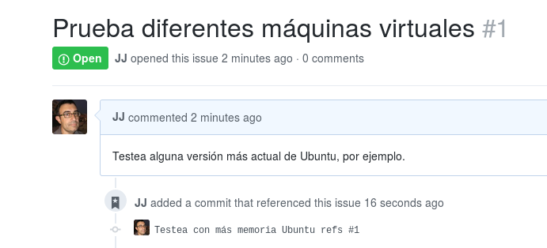

import { Head, Image, Appear } from 'mdx-deck'
import { SplitRight, Split, Horizontal, FullScreenCode } from 'mdx-deck/layouts'
import { CodeSurfer } from "mdx-deck-code-surfer"

<Head>
  <title>Git! Push</title>
  <meta name='twitter:site' content='@jjmerelo' />
  <meta name='twitter:title' content='Git! Push! What is it good for?' />
  <meta name='twitter:description' content='Absolutely everything!' />
  <link href="https://fonts.googleapis.com/css?family=Koho|Open+Sans" rel="stylesheet" /> 
</Head>


export { default as theme } from './theme'


# Git! Push!
## What is it good for?
# Absolutely *errthang*!
---


`@jjmerelo`
<Appear>
    <li>Autor (con <code>@psicobyte_</code>) de "Aprende git")</li>
    <li>Contribuyente a Perl 6</li>
    <li>Profe en UGR</li>
</Appear>
---
export default SplitRight


# `git`
---
export default SplitRight

# ¿Para qué sirve?


```notes
Hay mucho material dirigido específicamente a Wordpress, como este
curso: https://wppusher.com/wordpress-git-course 
En general, no se trata de algo demasiado especial, salvo los
requisitos específicos por estar desarrollando contra un sistema de
gestió de contenidos
```

---
export default SplitRight


# Para la nube

---
export default Split

# Pero ¿qué es?


---
export default SplitRight

# Un sistema de ficheros direccionado por contenido


---
export default SplitRight

# Con un sistema de gestión de versiones encima


---
export default SplitRight


# Distribuido

```notes
El que sea distribuido permite que se pueda trabajar y hacer `push` a
repos remotos, y es lo que lo ha convertido en una herramienta de
despliegue
```
---
export default SplitRight


# Con un sistema de eventos

```notes
Este sistema de eventos o *ganchos* sirve para lanzar acciones cada
vez que sucede algo, y permite regular flujos de trabajo.
```
---
export default Split

# *filesystem* direccionado por contenido tiene:


---
export default SplitRight

# *Blobs*


---
export default Split

# *Trees*


---
export default Split

# Y un sistema de gestión de fuentes tiene:


---
export default SplitRight


# * Commits * 

---
export default Split


# * Tags * 

```notes
Los objetos tipo Tag apuntan a un commit en una referencia inmutable https://git-scm.com/book/en/v2/Git-Internals-Git-References
```

---
export default SplitRight

# Aloja repos en GitHub, Bitbucket o Gitlab


```notes
Cada uno tiene sus ventajas y sus inconvenientes, aunque sin duda el
más popular para proyectos libres es GitHub. Si no es libre, Bitbucket
te permite una cierta cantidad de repos privados, igual que
GitLab. GitHub tiene muchas más integraciones que el resto, pero en
general es una elección personal o, por supuesto, corporativa
Un artículo sobre esto: https://www.elegantthemes.com/blog/tips-tricks/answering-the-most-important-questions-about-using-git-with-wordpress
```
---
export default FullScreenCode

```bash
git clone <URL con git o https>
git add <nuevo fichero>
git commit -m "Explico el cambio"
git pull # Evitando conflictos
git push
```

---
<CodeSurfer
  title="Clonación de Trellis en nuestro repo"
  code={require("!raw-loader!examples/git-inicial.sh")}
  lang="bash"
  showNumbers={true}
  dark={false}
  steps={[
    { notes: "Creando la configuración inicial"},
    { lines: [2,3], notes: "Clona Trellis en un repo" },
    { lines: [4,5], notes: "Añade a nuestro repo" },
    { lines: [6,7], notes: "Crea un tag y lo sube a GitHub" },	
  ]}
/>

```notes
Se trata de un *shallow clone*
https://stackoverflow.com/questions/23708231/git-shallow-clone-clone-depth-misses-remote-branches
Descarga commits hasta un máximo de uno, es decir, el estado del repo
en el último commit y ya está. No puedes consultar la historia, por
ejemplo. También ponemos un tag para volver aquí cuando
queramos. También empezamos a ver la naturaleza distribuida de git,
manejando dos remotes, el original que se suele llamar *upstream*
```

---
### ①②③ Para los ránkings de `@iblancasa`


```notes
Estos ránkings los inicié yo, pero ahora se publican todos los
miércoles, Tienen ránkings por comunidad autónoma y provincia y
también nacionales, en JSON o MD. Te pueden servir para descubrir a
gente cerca tuyo o simplemente para picarte con tus compis
```

---
export default Split

# Organízate


```notes
Los issues y milestones (o mojones) de los sitios de hosting son una
forma de organización de un equipo de trabajo, y también una buena
forma de comunicarse con la comunidad de software libre
```
---
## Por ejemplo: contribuyentes en *Hacktoberfest*


---


<CodeSurfer
  title="Modificando YAML"
  code={require("!raw-loader!examples/vagrant.default.yml")}
  lang="yaml"
  showNumbers={true}
  dark={false}
  steps={[
    { notes: "Cambiamos la máquina virtual a Ubuntu 18.04"},
    { lines: [5], notes: "Alterando vagrant_box" },
    { lines: [6], notes: "También la versión" },
  ]}
/>

---
export default Split

# Cuida los mensajes de commit


```notes
Los mensajes deben ser predicados cuyo sujeto es el cambio que has
hecho. Los cambios deben ser atómicos
```
---

# Y trabaja siempre contra una tarea

```bash
git commit -am "Testea con más memoria Ubuntu refs #1"
git push
```



---

# Comprobando issues

```perl
use Path::Tiny;

my $msg_file = shift;
my $msg = path($msg_file)->slurp;
my @issues = ($msg =~ /\#(\d+)/g);
exit(1) if (!@issues );
my $repo_uri = `git config --get remote.origin.url`; # ← URL del repo
my ($user,$repo) = ($repo_uri =~ /(\w+)\/([^.]+)/);
for my $i (@issues) {
  my $issue = `wget -q -O - https://github.com/$user/$repo/issues/$i`;
  unless ($issue) {
    say "✘ Commit incorrecto, issue #$i no existe";
    exit(1);                                         # ← Sale si no cumple
  }
}
```

---
export default Split


# Corrigiendo

```bash
git commit --amend
```

---
export default Split


# Sucede a menudo

```bash
git config --global alias.jo 'commit --amend'
git jo
```
---

# Recordando todo: 

`~/.gitconfig`

```ini
[user]
	email = jjmerelo@gmail.com
	name = JJ Merelo
[push]
	default = matching
[core]
	editor = emacs
[rerere]
	enabled = true
[alias]
	jo = commit --amend
```

---
export default SplitRight


# Busca y encontrarás

```bash
git grep password
```

```notes
Aparece en demasiado sitios, así que habrá que ocultarlo. Una gestión
segura de API keys y passwords incluye usar de forma hábil el
.gitignore
```

---
# `.gitignore` para la seguridad

```bash
cp trellis/.gitignore . # Directorio "root" del repo
```

---

<CodeSurfer
  title=".gitignore siempre presente"
  code={require("!raw-loader!examples/gitignore")}
  lang="bash"
  showNumbers={true}
  dark={true}
  steps={[
    { lines: [1], notes: "Clave para el vault de Ansible" },
    { lines: [3], notes: "Otras claves locales" }
  ]} />

```notes
En .vault_pass estarán todas las claves que te servirán para descifrar
las claves cifradas que uses en Ansible y demás:
https://roots.io/trellis/docs/vault/
```

---
